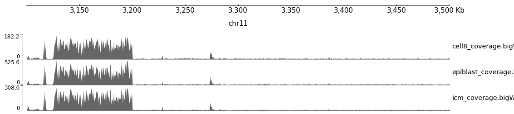

# Колаб
https://colab.research.google.com/drive/1IzSeA8acUjTzPAT9-CY-K5RuZvePkErD?usp=sharing

# Отчёты FastQC
### Per base-содержание

Видно, что графики показывают разные результаты. В SRR5836473_1 почти полностью отсутствует цитозин (C), а тимин (T) присутствует в большей степени, чем в РНК. Содержание гуанина (G) и ацетозина (A) сравнимо с тем, что наблюдается в SRR3414630_1.

### GC-содержание

Видим, что на первом графике наблюдается нормальное распределение.

В таблице указано количество прочтений, сопоставленных в областях 11347700-11367700 и 40185800-40195800, а также процент дублированных прочтений для каждого образца.

### Число ридов
BS-Seq | ch11: 11347700-11367700 | ch11: 40185800-40195800 | дедуплиц. 
--- | --- | --- | ---
SRR5836473 | 1090 | 464 | 81.69
SRR3824222 | 2328 | 1062 | 97.08
SRR5836475 | 1456 | 630 | 90.92

# Уровни метилирования образцов
Графики иллюстрируют уровень метилирования в каждой возможной позиции чтения. Ось Y графиков показывает значение вызовов метилирования слева и долю метилирования справа. Поскольку у парно-концевой записи есть два конца, для каждого прогона представлены два разных графика.

### SRR3824222

 

### SRR5836473

 

### SRR5836475

 

## Распределение метилирования цитозинов по хромосоме
### Epiblast

### 8 Cell

### ICM

Можно определить, что для каждого образца частота и процент метилирования различаются. Для первого образца наиболее часто наблюдается 0% метилирование, происходящее почти в 40% случаев. Для второго образца чаще всего наблюдается 100% метилирование, что указывает на то, что метилирование может участвовать в регуляции экспрессии генов. В третьем примере наиболее часто встречается 0% метилирование, встречающееся почти в 60% случаев.

## Визуализация уровня метилирования и покрытия для каждого образца
### Уровень метилирования

### Уровень покрытия

